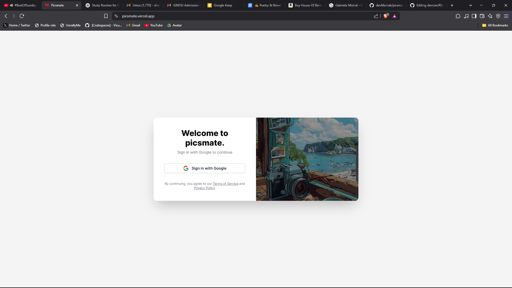
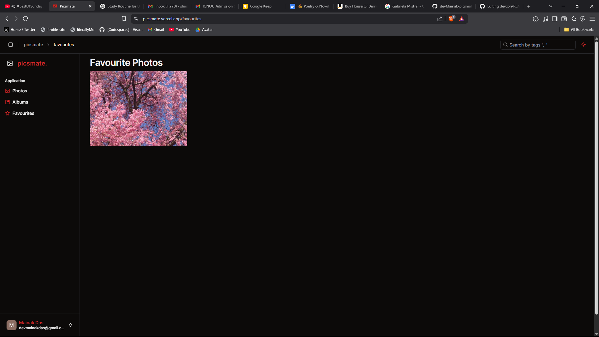

# 📸 Picsmate

A modern full-stack photo album manager — create albums, upload and tag images, explore photos, and manage everything in a sleek, responsive UI.


## ✨ Tech Stack

### 🖥 Frontend

- **React 18** + **Vite** – Lightning-fast modern frontend
- **Redux Toolkit** – State management done right
- **Tailwind CSS** – Utility-first styling with zero bloat
- **ShadCN/UI** – Beautiful, accessible components
- **Axios** – Smooth and clean HTTP requests

### 🚀 Backend

- **Express** + **Node.js** – Simple and scalable server
- **MongoDB + Mongoose** – Flexible NoSQL database
- **Multer** – Handling image uploads with ease
- **Cloudinary** – Image hosting and optimization
- **Google OAuth 2.0** – Secure authentication

---

## 📦 Features

- 🔒 **User Authentication** – Login via Google OAuth
- 📁 **Album Management** – Create and browse albums
- 🖼 **Image Upload** – Upload, preview, and tag photos
- 🔍 **Search** – Find photos by name, tag, or person
- 🌗 **Dark Mode** – Theme toggle for better vibes
- 📤 **Cloud Image Storage** – Cloudinary integration
- 🛡️ **Secure Uploads** – Multer and validation in place
- 🧠 **Smart UI** – Built with accessibility and responsiveness in mind

---

## 🌟 Screenshots

### **Signup**


### **Photos**


### **Albums**


### **Upload Picture**


### **Image View**


### **Favourite**

---

## 🧪 Getting Started

### Prerequisites

- Node.js ≥ 18
- MongoDB (local or Atlas)
- Cloudinary account
- Google OAuth credentials

### 1. Clone the repository

```bash
git clone https://github.com/devMainak/picsmate.git
cd picsmate
```
